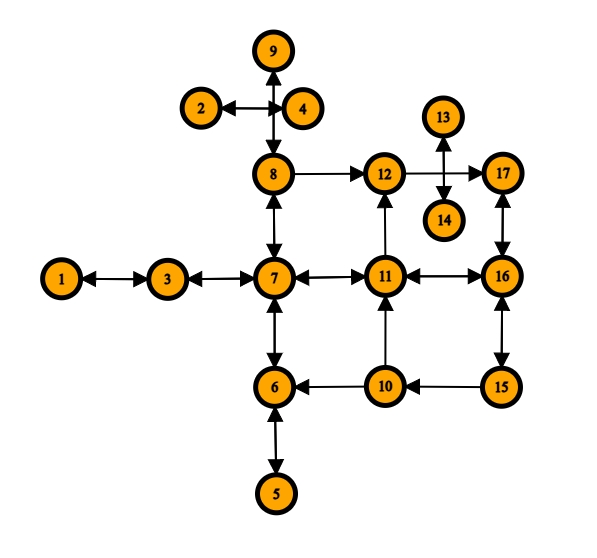

# pgRouting

Sample Boost and C++ implementation

## Installation
```
sudo apt install g++
sudo apt-get install libboost-all-dev
```
## pgRoutingSampleData C++ Implementation(Adjacency List)

## pgRoutingSampleData Boost Implementation 
## Proposal Example C++ Implementation(Adjacency List)
## Boost Example Boost Implementation

